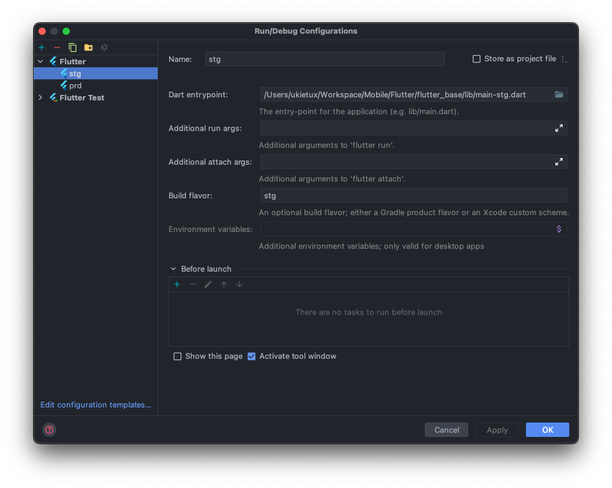
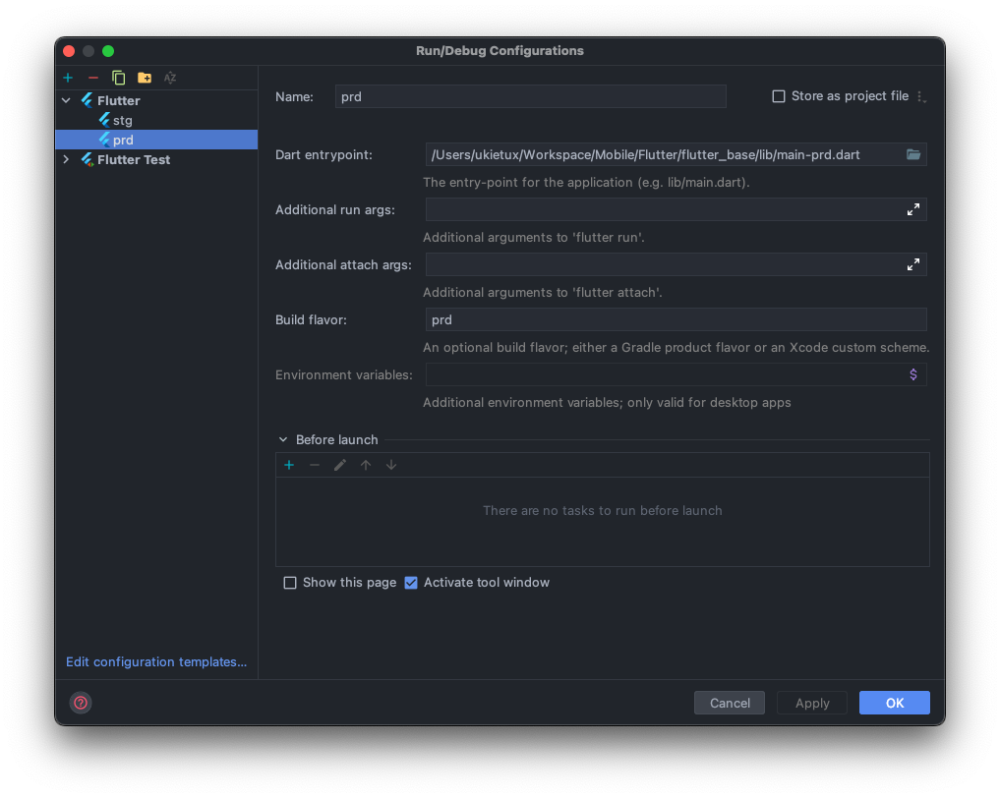

<br>

# Ayiconnect Test 🏠

This is my base project for Flutter App with Implementing **Flutter Clean Architecture with TDD**

### Architecture Proposal by [Resocoder](https://github.com/ResoCoder/flutter-tdd-clean-architecture-course)

<br>


## Get Started 🚀

- Clone this project
- Run `flutter run --flavor stg -t lib/main_stg.dart` for **staging** or
- Run `flutter run --flavor prd -t lib/main_prd.dart` for **production**
- Run Test `flutter test`
- To generate launcher icon based on Flavor `flutter pub run flutter_launcher_icons:main -f flutter_launcher_icons*`

## Feature ✅

- [x] BLoC State Management
- [x] **Clean Architecture with TDD**
   - [x] Unit Test
   - [x] Widget Test
   - [x] BLoC test
- [x] Theme Configuration : `System, Light, Dark`
- [x] Multi Language : `English, Bahasa`
- [x] Login, Register Example
- [x] Pagination Example
- [x] [Autofill Username and Password](https://github.com/lazycatlabs/flutter_auth_app/pull/3)

## TODO 📝

- [ ] Integration Test
- [x] Implement multi flavor
- [ ] Implement [Go Router](https://pub.dev/packages/go_router)

### Project Structure

````
  lib
   ├── core
   │   ├── core.dart
   │   ├── core_mapper.dart
   │   ├── error
   │   │   ├── error.dart
   │   │   ├── exceptions.dart
   │   │   └── failure.dart
   │   ├── localization
   │   │   ├── generated
   │   │   │   ├── strings.dart
   │   │   │   ├── strings_en.dart
   │   │   │   └── strings_id.dart
   │   │   ├── intl_en.arb
   │   │   ├── intl_id.arb
   │   │   ├── l10n.dart
   │   │   └── localization.dart
   │   ├── usecase
   │   │   └── usecase.dart
   │   └── wrapper
   │       ├── result.dart
   │       └── wrapper.dart
   ├── data
   │   ├── data.dart
   │   ├── datasources
   │   │   ├── datasources.dart
   │   │   ├── local
   │   │   │   ├── data_helper.dart
   │   │   │   ├── local.dart
   │   │   │   └── pref_manager.dart
   │   │   ├── mapper
   │   │   │   ├── auth
   │   │   │   │   ├── auth.dart
   │   │   │   │   ├── login_mapper.dart
   │   │   │   │   ├── register_mapper.dart
   │   │   │   │   └── users_mapper.dart
   │   │   │   └── mapper.dart
   │   │   └── remote
   │   │       ├── auth_remote_datasources.dart
   │   │       ├── model
   │   │       │   ├── auth
   │   │       │   │   ├── auth.dart
   │   │       │   │   ├── login_response.dart
   │   │       │   │   ├── register_response.dart
   │   │       │   │   └── users_response.dart
   │   │       │   └── model.dart
   │   │       ├── remote.dart
   │   │       └── services
   │   │           ├── dio_client.dart
   │   │           ├── dio_interceptor.dart
   │   │           ├── list_api.dart
   │   │           └── services.dart
   │   └── repositories
   │       ├── auth_repository_impl.dart
   │       └── repositories.dart
   ├── di
   │   ├── di.dart
   │   └── services_locator.dart
   ├── domain
   │   ├── domain.dart
   │   ├── entities
   │   │   ├── auth
   │   │   │   ├── auth.dart
   │   │   │   ├── login.dart
   │   │   │   ├── register.dart
   │   │   │   └── user.dart
   │   │   └── entities.dart
   │   ├── repositories
   │   │   ├── auth_repository.dart
   │   │   └── repositories.dart
   │   └── usecases
   │       ├── auth
   │       │   ├── auth.dart
   │       │   ├── get_users.dart
   │       │   ├── post_login.dart
   │       │   └── post_register.dart
   │       └── usecases.dart
   ├── presentation
   │   ├── page
   │   │   ├── app_route.dart
   │   │   ├── auth
   │   │   │   ├── auth.dart
   │   │   │   ├── cubit
   │   │   │   │   ├── cubit.dart
   │   │   │   │   ├── login_cubit.dart
   │   │   │   │   └── register_cubit.dart
   │   │   │   ├── login_page.dart
   │   │   │   └── register_page.dart
   │   │   ├── main
   │   │   │   ├── cubit
   │   │   │   │   ├── cubit.dart
   │   │   │   │   └── navdrawer_cubit.dart
   │   │   │   ├── dashboard
   │   │   │   │   ├── cubit
   │   │   │   │   │   ├── cubit.dart
   │   │   │   │   │   └── users_cubit.dart
   │   │   │   │   ├── dashboard.dart
   │   │   │   │   └── dashboard_page.dart
   │   │   │   ├── main.dart
   │   │   │   ├── main_page.dart
   │   │   │   ├── menu_drawer.dart
   │   │   │   └── settings
   │   │   │       ├── cubit
   │   │   │       │   ├── cubit.dart
   │   │   │       │   └── settings_cubit.dart
   │   │   │       ├── settings.dart
   │   │   │       └── settings_page.dart
   │   │   ├── pages.dart
   │   │   └── splashscreen
   │   │       └── splash_screen_page.dart
   │   ├── presentation.dart
   │   ├── resources
   │   │   ├── dimens.dart
   │   │   ├── images.dart
   │   │   ├── palette.dart
   │   │   ├── resources.dart
   │   │   └── styles.dart
   │   └── widgets
   │       ├── animated_flexible_space_bar.dart
   │       ├── app_bar_sliver.dart
   │       ├── button.dart
   │       ├── button_negative.dart
   │       ├── button_notification.dart
   │       ├── button_outline.dart
   │       ├── button_pair.dart
   │       ├── button_text.dart
   │       ├── check_box.dart
   │       ├── circle_image.dart
   │       ├── color_loaders.dart
   │       ├── custom_dialog.dart
   │       ├── date_chooser.dart
   │       ├── disable_focus_node.dart
   │       ├── drop_down.dart
   │       ├── empty.dart
   │       ├── header.dart
   │       ├── image_network.dart
   │       ├── indicator_slider.dart
   │       ├── label.dart
   │       ├── loading.dart
   │       ├── measure_size.dart
   │       ├── parent.dart
   │       ├── persistence_header.dart
   │       ├── radio_group.dart
   │       ├── sex_picker.dart
   │       ├── spacer_h.dart
   │       ├── spacer_v.dart
   │       ├── text_d.dart
   │       ├── text_f.dart
   │       ├── text_icon.dart
   │       ├── toast.dart
   │       └── widgets.dart
   ├── utils
   │      ├── ext
   │      │   ├── context.dart
   │      │   ├── double.dart
   │      │   ├── ext.dart
   │      │   ├── string.dart
   │      │   └── widget.dart
   │      ├── helper
   │      │   ├── common.dart
   │      │   ├── constant.dart
   │      │   ├── currency_formatter.dart
   │      │   ├── helper.dart
   │      │   └── multipart_file_extended.dart
   │      ├── services
   │      │   ├── firebase_services.dart
   │      │   └── services.dart
   │      └── utils.dart
   └── main.dart

````

### Test Project Structure
````
test
  └── presentation
      ├── auth
      │   └── cubit
      │       ├── login_cubit_test.dart
      │       └── register_cubit_test.dart
      └── main
          ├── cubit
          │   └── navdrawer_cubit_test.dart
          └── dashboard
              └── cubit
                  └── users_cubit_test.dart
````


## Dart Code Metrics Usage

1. Run this command in terminal to add dart_code_metrics library <br>
   `$flutter pub add --dev dart_code_metrics`
2. Add configuration in `analysis_options.yaml`

## Running the project

### Pre-requisites

| Technology | Minimum Version | Installation Guide                                                    |
|------------|-----------------|-----------------------------------------------------------------------|
| Flutter    | v3.0.1          | [Flutter Official Docs](https://flutter.dev/docs/get-started/install) |
| Dart       | v2.17.1         | Installed automatically with Flutter                                  |

> Flutter relies on a full installation of Android Studio to supply its Android platform dependencies. However, you can write your Flutter apps in a number of editors.


[Flutter Official Docs](https://flutter.dev/docs/get-started/install) will guide you through configuring your preferred IDE or Code Editor. For this project, we recommends [Android Studio](https://developer.android.com/studio).

### Step-by-step
Once you have installed all the pre-requisites, please follow the steps below to run the frontend mobile application. You will need to issue a number of commands via your system's Terminal window.

1. **Clone the current repository to your machine**
2. **Open Android Studio/your IDE**
3. **Open the Project using your IDE**
4. **Installing all project dependencies**
    - *Installing dependencies declared in `pubspec.yaml`*<br>
      ```flutter packages get```

5. **Run the app**

### Commands
We have two flavors: STG and PRD

**Stg :**
*  pointed to stg firebase project (Mobile Apps - Staging)

*  Version name would be suffixed by stg

**#Run app in `stg` environment**
1. Run this command `flutter run -t lib/main_stg.dart  --flavor=stg` on the terminal, pointing the root of this project

OR

2. Edit run configurations in Android Studio, and add flavor "stg"



**Prd :**

*  Pointed to production firebase project (Mobile Apps)

**#Run app in `prd` environment**


1. Run this command `flutter run -t lib/main_prd.dart  --flavor=prd` on the terminal, pointing the root of this project


OR

2. Edit run configurations in Android Studio, and add flavor "prd"



## Upload to Playstore and Appstore
### 1. Playstore (Android)
1. Set the version code and version name at **pubspec.yaml** file. Update the following line: `version: 1.0.0+1`. The version number is three numbers separated by dots, such as `1.0.0` in the example, followed by an optional build number such as `1` in the example above, separated by a `+`.
2. Create build based on the flavor. The commands are below:

**Create appbundle for Prd**

`flutter build appbundle --flavor prd -t lib/main_prd.dart`

**Create appbundle for Stg**

`flutter build appbundle --flavor stg -t lib/main_stg.dart`

**Create APK for Stg**

`flutter build apk --flavor stg -t lib/main_stg.dart`

**Create APK for PRD**

`flutter build apk --flavor prd -t lib/main_prd.dart`

3. Upload the build to Playstore.


### 2. Appstore (ios)

1. On android studio, open the **ios** folder in xCode. 
2. Select the **Runner** project in the Xcode project navigator. Then, in the main view sidebar, select the **Runner** target. Select the  **General**  tab. Set the version code and build number on **General** tab. 
3. If you have set the certificate, go to next step. If you havent, please go to **Signing & Capabilities** and select **Automatically manage signing** and Select the team associated with your registered Apple Developer account. If required, select **Add Account…**, then update this setting.
4. Open terminal in Android Studio, create the build archive by running this command `flutter build ipa --flavor prd -t lib/main_prd.dart`
5. Open `build/ios/archive/MyApp.xcarchive`
6. Click the  **Validate App**  button. If any issues are reported, address them and produce another build. You can reuse the same build ID until you upload an archive.
7. After the archive has been successfully validated, click **Distribute App**. You can follow the status of your build in the Activities tab of your app’s details page on [App Store Connect](https://appstoreconnect.apple.com/).

You should receive an email within 30 minutes notifying you that your build has been validated and is available to release to testers on TestFlight. At this point you can choose whether to release on TestFlight, or go ahead and release your app to the App Store.


## Coding guide lines
* This project uses [Flutter BLoC](https://pub.dev/packages/flutter_bloc) as state management, every single feature must follow this state management.
* [SOLID principles](https://medium.com/flutter-community/s-o-l-i-d-the-first-5-principles-of-object-oriented-design-with-dart-f31d62135b7e) must not be broken.
* For project and coding structure, styles first go through this repo's codes first, your coding styles and structure has to be matched with this project's coding styles and structures.
* Any kind of anti-patterns must not be implemented or design pattern must not be broken.

## Commit Keywords ##

* [FEAT] (new feature)
* [FIX] (bug fix)
* [DOCS] (changes to documentation)
* [STYLE](formatting, missing semi colons, etc; no code change)
* [REFACTOR] (refactoring production code)
* [TEST] (adding missing tests, refactoring tests; no production code change)
* [CHORE] (updating grunt tasks etc; no production code change)
* [CLEAN] (removing dead code)
* [WIP] (work in progress for any FIX, FEAT, REFACTOR etc)

## Pull Request Format ##
Whenever you want to create an PR, on the description part, use existing format


## Pull Request Title Format ##
[COMMIT KEYWORDS] [Jira card number(s)] Description

Example: [FEAT] FB-160 Create UI Groups Page and Connect it into API

Commit Keywords

* [FEAT] (new feature)
* [FIX] (bug fix)
* [DOCS] (changes to documentation)
* [STYLE] (formatting, missing semi colons, etc; no code change)
* [REFACTOR] (refactoring production code)
* [TEST] (adding missing tests, refactoring tests; no production code change)
* [CHORE] (updating grunt tasks etc; no production code change)
* [CLEAN] (removing dead code)
* [WIP] (work in progress for any FIX, FEAT, REFACTOR etc)
* [STAGING] (release version, Eg: 1.0-alpha+build.1)
* [PREPROD] (release version, Eg: 1.0-beta+build.1)
* [PROD] (release version, Eg: 1.0)


If that PR contains more than one commit messages, please try to keep "Description" relevant to those commit messages.<br />
If that PR is for more than one JIRA card, please use comma "," to separate the number. Example: [FB-160,FB-158].


<h3 align="center">Buy me coffee if you love my works ☕️</h3>
<p align="center">
  <a href="https://www.buymeacoffee.com/ukieTux" target="_blank">
    
  </a>&nbsp;&nbsp;&nbsp;&nbsp;
   <a href="https://ko-fi.com/ukietux" target="_blank">
    
  </a>&nbsp;&nbsp;&nbsp;&nbsp;
  <a href="https://paypal.me/ukieTux" target="_blank">
    
  </a>
  <a href="https://saweria.co/Lzycat" target="_blank">
    
  </a>
</p>
<br><br>
